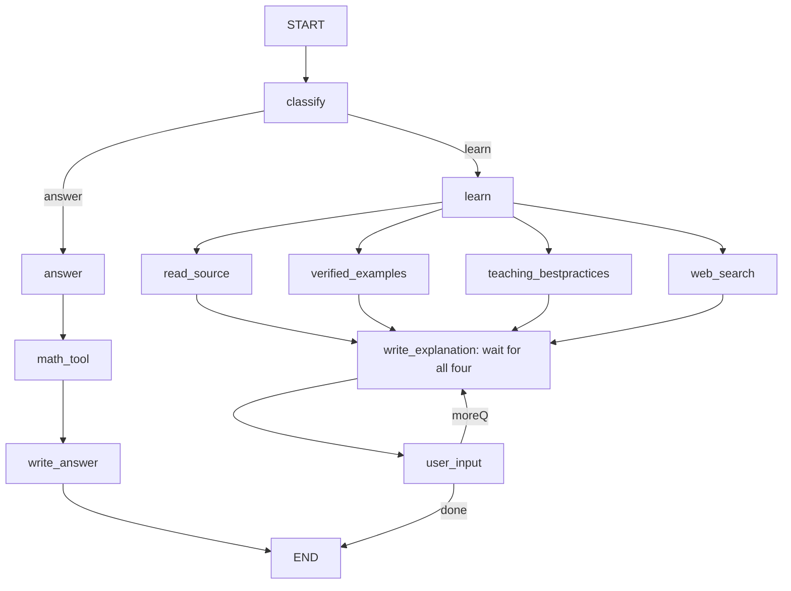

# MathTutor

The governing documents are version 2.6 in `specs/math_tutor_spec.md` and `specs/math_tutor_implementation_prompt.md`. Phase 3 is now authorized: four official OpenStax PDFs are downloaded, with readable prose extracts, seven original starter topic notes, a private 51-example Paul bank and 15 teaching rules. Phase 3 remains incomplete because representative PDF formulas are omitted or flattened, and example level gaps are recorded. Installed SymPy and multilingual embeddings passed earlier real acceptance checks; AvalAI live access has not been rechecked in this phase. Supplied PDFs under `files/` are preserved. See the [Phase 3 report](sources/manifests/phase3_report.md); earlier phase results below are historical.

## Current implementation — Phase 7 search, local retrieval and full/step learning

`agent.py` owns schemas, typed state/reducers, safe math payload construction, spawned math workers and the real compiled eleven-node LangGraph shown below. `learning.py` contains local evidence adapters and learning node bodies; `lesson_steps.py` validates short teaching content and parses lesson replies. `retrieval.py` adds local semantic retrieval. `build_graph(config, model=None, search_client=None, *, math_runner=..., retrieval_client=None, resource_workers=None, checkpointer=None, embedding_client=None)` supports service injection. Essential missing input pauses inside existing nodes, using an in-memory checkpoint and same-thread `Command(resume=...)`. `cli.py` owns input, display, commands and resume, and never executes graph routes itself.

Learn fans out concurrently to four resource nodes and waits at one all-predecessor barrier. Full explanations use a level-specific model prompt with actual local passages and teaching rules; provenance and one matching Paul example are appended from validated records. With no model, the writer shows actual passages with level-specific framing and explicitly says that tailored follow-up synthesis is unavailable. Missing evidence is reported without invented lessons or examples. Source URLs are validated and serialized as strings so evidence survives checkpoint/resume.

Full delivery explains the lesson and pauses for a follow-up or `done` / `تمام`. Step delivery caches a source-grounded plan, displays one small chunk and pauses. Only next advances; questions and confusion retain the position; full explains the remainder. The worked example is delayed until its final step, unless explicitly requested. A recognized wholly new topic ends the old lesson and starts a fresh CLI request. The CLI prints each explanation version once, including before an interrupt, and does not reprint it on done or help. `web_search` calls its configured backend independently of the three local resource branches. Disabled/unconfigured search is explicitly skipped; failures leave the local lesson available.

OpenAI integration was inferred from the existing credential variable. Credentials are read only during explicit startup, kept outside graph state, excluded from configuration dumps and never printed. The `.env` file is optional, loaded once without replacing existing environment variables. This follows [official OpenAI authentication guidance](https://developers.openai.com/api/reference/overview). `TUTOR_MODEL` is intentionally unset until the user configures a model available to their account. Local syntax needs no model; natural-language extraction uses the configured/injected provider, validated output and at most one malformed-output repair. Provider failures/timeouts use safe readable errors. No live provider smoke test was run. Use `--offline` to prevent model calls even if a model is configured.

PowerShell setup for a fresh installation:

```powershell
Set-Location E:\Agentic\MathTutor
python -m venv .venv
.\.venv\Scripts\python.exe -m pip install -r requirements.txt
# Only if .env does not already exist:
if (-not (Test-Path -LiteralPath .env)) { Copy-Item -LiteralPath .env.example -Destination .env }
.\.venv\Scripts\python.exe cli.py --check
.\.venv\Scripts\python.exe -m unittest discover -s tests -v
```

The environment uses `python -m venv --system-site-packages .venv` to reuse installed dependencies. Python 3.10.5, LangGraph 1.2.12, LangChain 1.4.2, langchain-openai 1.6.4, Pydantic 2.13.5 and python-dotenv 1.2.3 were tested. SymPy 1.14.0 is installed; actual differentiation, integration, limits, roots, matrices and simplification acceptance checks passed in the installation follow-up and final regression. Earlier blocked-installation results below are historical. `cli.py --check` reports absent dependencies as null and exits 2; it prints credential presence flags, never values.

The empty `.env.example` lists every supported setting. Blank settings use defaults: answer mode, Persian, full delivery, unknown learner level, search disabled, generated examples disabled. Set `TUTOR_LEVEL` to `beginner`, `intermediate` or `advanced`; `TUTOR_DELIVERY` to `full` or `step`; `TUTOR_LANGUAGE` to `fa` or `en`. Explicit request choices override session preferences. Limits cover input length, expression size/depth, matrix dimensions, tool/request deadlines, evidence/history size and bounded repair attempts. Unknown settings in schema payloads and invalid enums are rejected.

Actual Phase 2 verification: the full suite collected 41 tests, **34 passed and seven real-math tests skipped** because SymPy is not installed. After final routing/counter hardening, the focused Phase 2 suite collected 21 tests: **14 passed and seven skipped**. Tests invoke the actual compiled LangGraph and inspect its partial node/edge set, exercise interrupt/resume, demonstrate provider extraction is not repeated after resume, verify one repair and recoverable failures/deadlines, preserve commands during clarification, reset, Unicode/EOF, and kill/reap an actual timed-out worker. The x=6 graph/CLI checks use an injected result; they are not a claim that SymPy calculated x=6 here. An actual CLI/worker smoke test returned the missing-SymPy message. Imports/provider construction and offline CLI tracing checks forbid sockets. No successful live provider or search integration was exercised.

Math payloads use an allowlisted recursive AST and discriminated operation schemas for differentiation, integration, limits, equations, matrices and simplification. Local syntax tokenizes a restricted math grammar and inspects `ast.parse`; it never evaluates Python or sends arbitrary strings to SymPy parsers. SymPy objects are built with explicit constructors inside a spawned Windows-compatible interpreter. Each worker receives validated JSON, has numeric/power/input/depth/matrix/output limits and a killable process deadline. Unsolved results stay unresolved; numeric samples are not used as proof. This code is implemented but its actual mathematical behavior remains unverified until SymPy is installed.

Historical missing-dependency setup commands (SymPy is now installed):

```powershell
.\.venv\Scripts\python.exe -m pip install sympy==1.14.0
.\.venv\Scripts\python.exe cli.py --offline
.\.venv\Scripts\python.exe cli.py --offline --query "2x+5=17"
.\.venv\Scripts\python.exe -m unittest discover -s tests -v
```

Local syntax examples (expected mathematical results must still be verified):

| Request | Intended operation |
|---|---|
| `2x+5=17` or `solve x^2=4` | Equation roots, default real domain |
| `diff x^3` | Differentiate with respect to x |
| `diff y^2 wrt y` | Choose a variable explicitly |
| `integrate x^2` | Indefinite integral, including + C |
| `integrate x^2 from 0 to 1` | Definite integral |
| `limit sin(x)/x at 0 both` | Two-sided limit |
| `limit 1/x at 0 left` | One-sided limit |
| `matrix determinant [[1,2],[3,4]]` | Numeric matrix determinant |
| `matrix inverse [[1,2],[3,4]]` | Matrix inversion; singular matrices fail clearly |
| `simplify x/x` | Simplification with original exclusions preserved |

Use parentheses for sin/cos/tan/exp/log/sqrt/abs. Constants include pi, E and oo. Carets and implicit multiplication are supported. The local grammar defaults to variable x; use `wrt` for another variable. Complex-domain calculations, derivative orders and matrix multiplication use the validated JSON problem schema or provider extraction. Local matrix shorthand accepts numeric JSON entries. Free-text assumptions, compound power exponents and symbolic integration bounds are explicitly unsupported in this phase. Real definite integrals crossing unresolved/internal excluded points must be split; the worker does not silently compute a principal value. Antiderivatives are checked symbolically and valid-domain restrictions retained; a returned formula may cover only the stated intervals. See [SymPy calculus](https://docs.sympy.org/latest/tutorials/intro-tutorial/calculus.html) and [solveset domain behavior](https://docs.sympy.org/latest/modules/solvers/solveset.html).

Current commands: `/help`, `/mode answer|learn`, `/delivery full|step`, `/level beginner|intermediate|advanced`, `/language fa|en`, `/reset`, `/debug on|off`, `/exit`. Level also accepts مبتدی/متوسط/پیشرفته. Settings apply to the next request; `/delivery full` additionally resumes an active learning lesson to explain its remainder. It does not become a math clarification reply. Blank input is ignored; EOF/Ctrl+C exits safely. `/reset` abandons pending state/history and creates a fresh thread while retaining preferences. Each new request gets a fresh thread; an interrupted request resumes its existing thread. LangGraph durable tasks cache math extraction outcomes so a model call before an interrupt is not repeated. Python 3.10 receives explicit runnable context for tasks and interrupts. CLI execution disables inherited network tracing; debug displays only new node/status traces.

Evidence requires actual source text and provenance. Statuses are success/empty/skipped/error. Source-backed examples default to unknown verification; verified/rejected decisions require a verification method. No runtime corpus or examples were generated in Phases 1, 2, 4 or 5. `tests/fakes.py` implements injectable async service interfaces for offline graph tests and never supplies a substitute graph engine.

## Authorized graph and interaction contracts

The diagram below is the **actual compiled graph**. It uses [LangGraph StateGraph and reducers](https://docs.langchain.com/oss/python/langgraph/graph-api). The displayed resource arrows are one all-predecessor barrier. Follow-up, next, simplify and full all use the same user_input → write_explanation loop; done reaches END. Phases 5 and 6 add no nodes or edges.



The four incoming resource arrows represent **one** `add_edge([all_four], 'write_explanation')` barrier, never four separate triggers. Each branch owns one evidence field: read_source → source; verified_examples → examples; teaching_bestpractices → teaching_tips; web_search → websearch. They share the pre-fan-out question/topic/level, run independently, and append warnings/traces through reducers. Messages use LangGraph's `add_messages`. New-request state resets evidence and lesson progression, keeps only bounded history and explicit preferences, and must start at a new or finished thread boundary; passing empty lists to an active checkpoint does not clear append reducers.

| Node | Contract |
|---|---|
| classify | Validated answer/learn route; essential clarification interrupts inside this node |
| answer | Prepare supported calculation payload |
| math_tool | Bounded safe SymPy worker; preserve domains/exclusions |
| write_answer | Concise result and necessary restrictions or + C |
| learn | Establish level, objective, delivery and shared evidence request |
| read_source | Bounded local source passages with provenance |
| verified_examples | Retrieve matching local Paul examples; supported computational checks |
| teaching_bestpractices | Original level-specific teaching guidance |
| web_search | Independent search or explicit skipped/error result |
| write_explanation | Combine four results; internal checks/repairs; no extra nodes |
| user_input | Checkpointed pause, resume follow-up/next or finish |

| Learner level | Explanation contract |
|---|---|
| beginner / مبتدی | Everyday intuition, defined symbols, small steps and simple examples |
| intermediate / متوسط | Connected definitions, method selection and common mistakes |
| advanced / پیشرفته | Precise assumptions, definitions, proof sketches and exceptions |

Full delivery produces an explanation, then pauses for follow-up/done. Follow-ups loop directly from user_input to write_explanation, preserving evidence. Step delivery stores stable `lesson_plan`, `step_index` and `last_emitted_step` values; model planning happens once before the first pause. No new graph nodes are authorized.

## Step teaching and controls

Start the CLI with `.\.venv\Scripts\python.exe cli.py --offline`, then enter:

```text
/mode learn
/delivery step
/level beginner
/language en
Explain derivatives
```

Prepared topic notes are required for actual content. A configured model provides tailored planning, simplification and answers; without a model, steps show labelled actual source excerpts. With neither notes nor a model, the application shows a short honest unavailable-evidence message and pauses; it does not fabricate a derivative lesson.

| Reply | Effect |
|---|---|
| next / continue / بعدی / ادامه / اوکی / ok / okay | Emit exactly the next cached step, then pause |
| simplify / I don't understand / نفهمیدم / متوجه نشدم | Explain the same idea more simply; index stays fixed |
| A follow-up question | Answer in the lesson/current-step context; index stays fixed |
| full / کامل بگو / `/delivery full` | Explain only the material after the displayed step, including the final example; switch to full |
| done / تمام / پایان | End only this lesson; return to the CLI prompt |

An acknowledgment with a question, such as “Okay, but why?”, is a follow-up rather than next. After the final step, next/full report completion without inventing new steps. The completed lesson still accepts questions or done. Direct invalid resume payloads re-prompt within a bounded limit without changing the step or replaying planning. Empty CLI input is ignored.

Teaching text is normally 2–3 short sentences plus necessary notation; source citations and complete worked-example records are displayed separately. Plan and response schemas check sentence count, size and source IDs, with at most two writer repairs. Explicit TeX/code units and decimals are preserved by the offline chunk helper. Without a model, simplification repeats the current excerpt and explicitly reports that tailored simplification is unavailable. Overlong complete units are omitted with a coverage notice, never cut into broken formulas. This basic sentence helper is not Phase 6 structural/semantic ingestion.

Examples appear only when their cached final step is reached, when full reveals the remainder, or when the learner explicitly requests an example. One matching example is shown per such response; a different candidate is preferred when appropriate. Ordinary follow-ups do not reveal future examples. Questions reuse the cached evidence without rerunning resource nodes. If cached evidence cannot answer, the writer is instructed to say so; this phase adds no new retrieval route or live search.

Phase 5 full offline suite: **81 collected, 73 passed, eight SymPy checks skipped**. The 22 new Phase 5 checks passed in that run. They exercise the actual compiled graph, source-backed synthetic fixtures and fake provider responses, including Persian/English chunks, stable progression, no replay, full remainder, delayed examples, reset, commands, EOF/Ctrl+C, bounded failures and one-shot return codes. An actual subprocess CLI smoke exited 0 after offline step/simplify/full/done/exit, reporting the absent corpus honestly. No live provider or real corpus teaching was exercised.

```powershell
.\.venv\Scripts\python.exe -m unittest discover -s tests -p test_step_teaching.py -v
.\.venv\Scripts\python.exe -m unittest discover -s tests -v
```

## Phase 7 search and final integration

### AvalAI configuration

For AvalAI-issued keys use its OpenAI-compatible chat base URL and its distinct search route, documented in [AvalAI quick start](https://docs.avalai.ir/en/quickstart) and [Tavily search](https://docs.avalai.org/en/providers/tavily):

```dotenv
TUTOR_MODEL_BASE_URL=https://api.avalai.ir/v1
TUTOR_SEARCH_BACKEND=avalai_tavily
TUTOR_SEARCH_URL=https://api.avalai.ir/v1/search/tavily-search
TUTOR_SEARCH_ENABLED=true
TUTOR_KEYS_FROM_DOTENV=true
```

Keep the AvalAI chat key in `AVALAI_API_KEY` and the AvalAI search key in `TUTOR_SEARCH_API_KEY`. For an AvalAI model endpoint, the dedicated AvalAI key takes precedence over `OPENAI_API_KEY`. Set `TUTOR_KEYS_FROM_DOTENV=true` explicitly when nonempty keys in the local file should override inherited API key variables; this user's configuration enables it and both effective keys were checked against the file without displaying values. Without that opt-in, existing environment variables take precedence. The AvalAI search adapter sends its documented parameters and reads `snippet` results; direct Tavily uses `content`. Endpoint changes do not alter graph topology. For this Windows setup `.env` gives the spawned math worker 20 seconds and requests 60 seconds; `2x+5=17` was actually checked and returned `x=6` after the earlier five-second startup timeout.

Final offline suite: **108 collected, 99 passed, nine skipped**. All nine new Phase 7 checks passed. Eight skips require missing SymPy; one requires the actual embedding package/model. HTTP fixtures exercise the real asynchronous adapter and LangGraph, not a replacement scheduler. No actual remote provider/search/embedding success is claimed.

`web_search.py` implements the [Tavily Search API](https://docs.tavily.com/documentation/api-reference/endpoint/search) using installed/pinned HTTPX 0.28.1. Configure these settings in your local `.env`:

```dotenv
TUTOR_SEARCH_ENABLED=true
TUTOR_SEARCH_BACKEND=tavily
TUTOR_SEARCH_API_KEY=your-own-key
```

Search sends the current question to Tavily, requests basic search with at most five results, and disables generated answers, raw-page content and images. The existing request deadline bounds both the adapter and graph branch. A one-megabyte streamed response limit, URL/type validation, deduplication and complete-record context budgets bound the evidence. Missing keys skip cleanly; timeouts, authentication/rate/network errors and malformed responses return safe errors without exposing keys or response bodies. Search result URLs are citations; the adapter does not fetch those pages.

Full and step writers use bounded supplementary snippets with stable URL-derived IDs, titles, retrieval timestamps and distinct `Web excerpt` citations. Authors and source terms are explicitly unestablished rather than invented. Snippets do not replace the Paul bank or imply full-page review/computational verification. Local passages take priority within the combined evidence budget. Follow-ups reuse cached results without rerunning resource nodes. The exact eleven-node graph and four-predecessor barrier remain unchanged.

Internal writer checks retain bounded schema/content/source-ID repairs and now reject duplicate citation IDs and explicit unsupported tool-verification claims. They retain domain-condition instructions and display actual excerpts on synthesis failure. These checks are **not** a proof of arbitrary mathematics; real symbolic verification still needs SymPy and supported operation payloads. The full/step CLI and concise answer path remain covered by earlier acceptance checks.

```powershell
.\.venv\Scripts\python.exe -m unittest discover -s tests -v
.\.venv\Scripts\python.exe cli.py --check
.\.venv\Scripts\python.exe cli.py --offline
# Explicitly check only configured/available services:
.\.venv\Scripts\python.exe scripts\check_live_services.py
```

The live checker prints safe status-only JSON and returns 2 if any service is failed or not exercised. Its actual run here reported provider/search/embedding **not exercised**: no provider model, disabled/unconfigured search, and missing embedding package. When configured it performs one structured provider request, one real search, and one Persian query against two English synthetic embedding passages. That smoke is narrower than real-corpus acceptance. `--offline` disables both provider and search calls, while permitting strictly local embeddings.

Remaining work is resolving earlier blockers: install SymPy; prepare and review the reference corpus/example bank/guidance; install/download the pinned embedding model; configure a provider model and search key; then rerun actual mathematical, corpus and live-service checks. Acquisition instructions below remain applicable. No further phase was started.

## Phase 6 bilingual local retrieval

Final Phase 6 full suite: **99 collected, 90 passed, nine skipped** (eight missing-SymPy checks and one missing actual embedding model). The 18 focused retrieval checks include 17 passes and that one skip. Actual subprocess checks returned 2 for `--check` and `--index` because dependencies/corpus are missing; offline step/done/exit returned 0 with honest missing-evidence output and empty stderr.

The default source/example adapter now ranks local structural chunks by cosine similarity using L2-normalized vectors. It selects `intfloat/multilingual-e5-small`, pinned to revision `fd1525a9fd15316a2d503bf26ab031a61d056e98`, with 384 dimensions and a maximum 512-token input. The [model card](https://huggingface.co/intfloat/multilingual-e5-small) documents Persian support and the required `passage: ` / `query: ` prefixes; the adapter uses these for both languages. This selection has **not** passed real-model acceptance here. Runtime loading uses the [local-only SentenceTransformer API](https://sbert.net/docs/package_reference/sentence_transformer/model.html), never an automatic download.

Install and download explicitly from a network-enabled terminal:

```powershell
.\.venv\Scripts\python.exe -m pip install -r requirements-embeddings.txt
.\.venv\Scripts\python.exe scripts\download_embedding_model.py
$env:TUTOR_EMBEDDING_MODEL_DIR = 'E:\Agentic\MathTutor\.cache\models\multilingual-e5-small'
.\.venv\Scripts\python.exe cli.py --index
```

The download helper pins the revision and writes `.math_tutor_model.json`; keep this identity file with the model if copying it from another machine. Its successful download has not been exercised here. Prepared evidence is separately required: the current empty corpus makes `--index` report both banks empty. `--offline` prevents language-model calls but permits local embeddings. Set `TUTOR_SEMANTIC_ENABLED=false` to explicitly use keyword retrieval. All embedding settings are listed in `.env.example`; configured model identity, dimension and token limit must match the actual local model.

Source ingestion accepts the Phase 4 formats below plus reviewed `sources/text/**/*.md` or `.txt` with same-stem `.metadata.json`. Converted-text metadata requires `topic` and `provenance`, with optional `sections` keyed by exact heading containing `topic`, `subtopic`, and `learner_level`. Conversion alone does not supply this topic/provenance curation. Heading units and paragraph boundaries preserve display math/code; oversized records split into linked children retaining assumptions, parent IDs and adjacent IDs. An indivisible oversized formula is omitted with a coverage warning rather than truncated. Oversized example solutions retain the full logical statement/solution, original visible label and provenance; child chunks do not change the three-example quota.

Caches are `.cache/retrieval/sources.npz` and `examples.npz`, containing NumPy vectors and JSON metadata, loaded without pickle. The manifest records model/revision, dimension, prefixes, normalization, preprocessing version and content hashes. Unchanged chunks reuse vectors across restarts; changed/new chunks are embedded again, removed records disappear, and IDs deduplicate. Model/settings mismatch or corrupt vectors triggers a labelled fallback rather than mixing embeddings; rebuild explicitly with `cli.py --index --rebuild-index` after the intended configuration change.

Example topic/subtopic/level filters remain strict. Source prose permits compatible depth and a reported broader source search when inferred-topic coverage is absent. Eligible chunks are ranked and complete bounded text/provenance is returned to writers. Missing embeddings use controlled bilingual keyword/metadata matching labelled `keyword`; vectors never certify mathematical correctness. SymPy verification remains separate, with unknown status when unavailable. The real eleven-node LangGraph and its four-resource barrier remain unchanged; follow-up loops reuse cached evidence. Live search remains Phase 7.

Run `python -m unittest discover -s tests -p test_semantic_retrieval.py -v`. These checks use injected bilingual embeddings and synthetic passages to validate cache/chunk/filter/graph behavior; they do not demonstrate actual E5 retrieval quality. The actual-model acceptance case is skipped while its package/weights are missing. See [implementation status](IMPLEMENTATION_STATUS.md) for full-suite results and blockers.

## Phase 4 local evidence formats and verification

Use `/mode learn` then enter a topic question. Configure `TUTOR_LEVEL` as beginner/intermediate/advanced, `TUTOR_LANGUAGE` as fa/en and optionally `TUTOR_MODEL` for synthesis. The CLI also supports `TUTOR_MODE=learn` with `--offline --query "Explain derivatives"`; it prints the explanation and pause prompt, then returns 2 because an interactive reply is required.

The default adapter reads these local formats; preparing their real contents remains skipped Phase 3 work:

- `sources/topics/*.md`: heading-separated passages preserving formulas, with same-stem `.metadata.json` (or `.json`) containing `topic`, optional `subtopic`/`learner_level`, and a validated `provenance` object. Alternatively, topic `.json` files contain arrays of `SourceRecord` objects. Provenance requires source_url, section_title, source_author, retrieved_at, usage_terms_url and usage_terms. Notes lacking metadata are excluded with a readable error.
- `sources/examples/paul/*.jsonl`: `ExampleRecord` objects with nested provenance or the same provenance fields at the top level; preserve id, example_id, topic, subtopic, course, learner_level, statement, solution and visible source_example_label. Operation payload and proposed result are optional. The adapter deduplicates IDs, restricts each atomic topic/subtopic/level pool to three, filters levels, excludes rejected/original records and displays one. It never imports or generates replacement examples.
- `sources/teaching_bestpractices.md`: numbered or bullet rules; optional `[beginner, intermediate]` level tags. Untagged rules apply to all three levels. The reader does not manufacture the Phase 3 guidance when this file is missing.

The original Phase 4 adapter remains the keyword fallback behind the Phase 6 adapter. It uses controlled topic aliases including Persian, bounded file/record/context sizes and complete heading/record units. Stored verification assertions are reset and supported claims are recomputed in the bounded symbolic worker. Antiderivatives are checked by differentiating the candidate; scalar comparisons use an exact symbolic difference, never sampling. Domain assumptions are retained. Unresolved or unavailable workers leave verification unknown; unsupported result representations (including equation sets and matrix inverse/transpose strings) are labelled unsupported rather than claimed verified. Those representations still need dedicated identity/completeness checks in later integration. Generated fallback remains disabled in this phase.

Phase 4 tests invoke the real graph, inspect its complete nodes/edges and actual waiting-edge barrier, hold/release four fake services independently, and verify one writer after all four finish. Temporary synthetic local files exercise actual file retrieval and provenance; fake model responses exercise level prompts, context, bounded repairs and one example. They do not establish real OpenStax/Paul coverage or live model quality. See `IMPLEMENTATION_STATUS.md` for the final results and blockers.

## Phase 3 limited reference preparation — implemented, exit incomplete

Downloaded exactly Calculus Volume 1, Calculus Volume 2, College Algebra 2e and Introductory Statistics 2e: **207,178,833 actual PDF bytes**, with zero partial transfers. The official pages' discovered CMS resolved current PDF links and BY-NC-SA 4.0 license metadata; URLs, attribution, hashes, paths, per-page diagnostics and actual sizes are in [the manifest](sources/manifests/openstax_core.json). Prose extracts total 5,397,578 bytes across 3,426 pages. Spot checks found missing formula images in calculus/matrix content and flattened probability fractions. Raw extracts are excluded from retrieval; seven clearly attributed original project notes provide starter evidence instead of pretending to be book transcripts.

Selected 51 distinct problems from exactly eight linked Paul lesson pages. Statements, whole solutions, TeX, source diagram links/alt descriptions, visible example/part numbers, copyright and provenance remain together in `sources/examples/paul/selected.jsonl`. [Selection metadata](sources/manifests/paul_selection.json) records difficulty rationale and 21 missing topic/level slots. Difficulty is project judgment, not Paul-provided labels. No example is reused across levels. The [JSONL schema](sources/examples/schema.json) and importer enforce stable IDs and three-per-pool quotas. The historical bulk CLI is retired and leaves its old files preserved.

```powershell
# Already executed here; repeat acquisition reuses local PDFs and preserves review findings.
.\.venv\Scripts\python.exe -m pip install -r requirements.txt -r requirements-acquisition.txt
.\.venv\Scripts\python.exe scripts\prepare_core_sources.py --download --extract
# Exit 2 means required formula review/extraction remains incomplete, even if downloads succeeded.
.\.venv\Scripts\python.exe scripts\review_core_sources.py --render
.\.venv\Scripts\python.exe scripts\prepare_paul_examples.py --fetch --verify
.\.venv\Scripts\python.exe scripts\prepare_topic_notes.py
.\.venv\Scripts\python.exe scripts\check_phase3.py
# Idempotent validated import of an existing selected bank (no download):
.\.venv\Scripts\python.exe scripts\prepare_paul_examples.py --import-jsonl sources\examples\paul\selected.jsonl
```

The Phase 3 check uses metadata/keyword retrieval in Persian and English and a real LangGraph local lesson, without building embeddings or calling model/search APIs. An antiderivative is checked directly by differentiating its candidate. Equation checks compare the worker's complete finite solution set, preserving original denominator exclusions; infinite/conditional sets remain unsupported. Verification covers the indicated mathematical result, not every sentence or pedagogical claim. Finish formula remediation and suitable selected-example gaps before claiming the Phase 3 exit is complete. No later phase runs automatically.

## Source-use restrictions

Raw originals and converted corpora are ignored by Git and must not be published automatically. Paul permits private noncommercial copies retaining notices, but requires consent for incorporation into another product and restricts networked inclusion. See [Paul's terms](https://tutorial.math.lamar.edu/terms.aspx). Current [OpenStax corequisite preface](https://openstax.org/books/college-algebra-corequisite-support-2e/pages/preface) includes a restriction on ingestion into generative AI offerings without prior written permission. Check each exact original's notices. Acquisition/format review does not clear later tutor or embedding use; the manifest records that distinction. No permissions have been obtained or third parties contacted.

## Offline verification

```powershell
python -m unittest discover -s tests -v
```

Tests use synthetic documents and fake transfers. They check catalog coverage, path containment, rejection of wrong files, preservation of hidden solutions/TeX/MathML, hash-based review invalidation and incomplete-transfer handling. They do not prove formula fidelity for books that have not been supplied.
