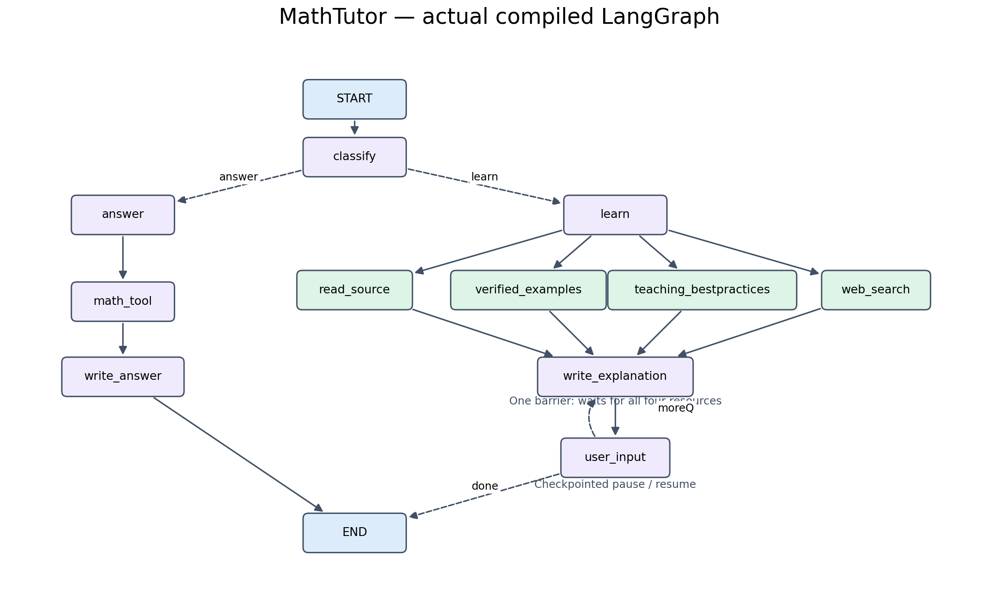

<div dir="rtl">

# MathTutor — دستیار آموزش ریاضی

MathTutor یک دستیار **CLI based** برای حل و آموزش ریاضی به دو زبان **fa|en** است. اجرای گردش کار کاملاً با **LangGraph** انجام می‌شود؛ **SymPy** محاسبات نمادین پشتیبانی‌شده را بررسی می‌کند و **Tavily** اطلاعات تکمیلی وب را فراهم می‌کند. اتصال مدل زبانی، جست‌وجو و مدل embedding در تنظیمات فعلی از طریق **AvalAI** انجام می‌شود.

## فناوری‌ها و مدل‌های مورد استفاده

| فناوری | نسخهٔ ثبت‌شده در پروژه | کاربرد |
|---|---|---|
| **LangGraph** | `1.2.12` | اجرای گراف، شاخه‌های هم‌زمان و توقف/ادامهٔ درس |
| **Pydantic** | `2.13.5` | قراردادهای نوع‌دار و اعتبارسنجی تنظیمات، ورودی ریاضی، شواهد و پاسخ ساختاریافتهٔ مدل |
| **SymPy** | `1.14.0` | محاسبات نمادین معادله، مشتق، انتگرال، حد، ماتریس و ساده‌سازی |
| **LangChain / langchain-openai** | `1.4.2` / `1.6.4` | پیام‌ها و اتصال به مدل سازگار با API؛ اجرای گردش کار همچنان با LangGraph است |
| **Tavily** | سرویس جست‌وجو | دریافت شواهد تکمیلی وب از مسیر مستقیم یا AvalAI |

**Pydantic** شکل داده و محدودیت‌های آن را بررسی می‌کند؛ این اعتبارسنجی به‌تنهایی اثبات درستی ریاضی نیست. **SymPy** عبارت‌های مجاز را در یک فرایند محدود به زمان محاسبه می‌کند و بررسی‌های قابل پشتیبانی روی مثال‌ها را انجام می‌دهد. نتیجهٔ حل‌نشده یا بررسی نامطمئن به‌عنوان تأیید قطعی نمایش داده نمی‌شود؛ تمام توضیحات زبانی نیز به‌صورت خودکار اثبات نمی‌شوند.

مدل‌های زیر در محیط فعلی پروژه تنظیم شده‌اند و از طریق endpoint مشترک `https://api.avalai.ir/v1` فراخوانی می‌شوند:

| کاربرد | مدل | تنظیم مرتبط |
|---|---|---|
| مدل زبانی برای فهم درخواست و تولید توضیح درس | **`gpt-4.1-mini`** | `TUTOR_MODEL` |
| مدل embedding برای بازیابی فارسی/انگلیسی | **`text-embedding-3-large`** | `TUTOR_EMBEDDING_MODEL`؛ ۳۰۷۲ بُعد و سقف ۲۰۴۸ توکن برای هر قطعه |

بردارهای متن و پرسش با همان مدل embedding ساخته می‌شوند و cache محلی دارند. backend فعال `avalai` است و مدل embedding محلی بارگذاری نمی‌کند. نام مدل‌ها در `.env` قابل تنظیم است؛ برای نصب تازه، دسترسی حساب خود به مدل انتخاب‌شده را بررسی کنید. استفاده از `--offline` فراخوانی مدل زبانی، embedding راه دور و جست‌وجو را غیرفعال می‌کند؛ محاسبات مستقیم SymPy همچنان در دسترس هستند.

## گراف LangGraph



این تصویر گراف کامپایل‌شدهٔ پروژه را نشان می‌دهد. مسیر پاسخ مستقیم از `answer` به `math_tool` و سپس `write_answer` می‌رود. در مسیر آموزش، چهار نود `read_source`، `verified_examples`، `teaching_bestpractices` و `web_search` هم‌زمان اجرا می‌شوند؛ `write_explanation` منتظر پایان هر چهار شاخه می‌ماند. نود `user_input` درس را برای ادامه یا پرسش کاربر متوقف می‌کند و با checkpoint و `Command(resume=...)` همان جلسه را ادامه می‌دهد.

پروژه ۱۱ نود اجرایی دارد. حلقهٔ CLI فقط ورودی و نمایش را مدیریت می‌کند؛ مسیریابی و اجرای نودها بر عهدهٔ LangGraph است. نسخهٔ متنی نمودار در [graph.mmd](graph.mmd) و کد تولید تصویر در [scripts/render_graph.py](scripts/render_graph.py) قرار دارند.

## قابلیت‌ها

- پاسخ مستقیم یا آموزش کامل و گام‌به‌گام، با سه سطح مبتدی، متوسط و پیشرفته.
- انتخاب زبان با `fa|en` و بازیابی منابع فارسی و انگلیسی با یک مدل embedding مشترک.
- حل معادله، مشتق، انتگرال، حد، عملیات ماتریسی و ساده‌سازی با ورودی محدود و اعتبارسنجی‌شدهٔ SymPy.
- پرسش تکمیلی و ساده‌سازی بدون جابه‌جایی مرحله؛ شروع مسئلهٔ تازه از مرحلهٔ اول، حتی در `reply>`.
- نمایش راست‌به‌چپ فارسی در کنسول ویندوز، همراه با حفظ ترتیب چپ‌به‌راست فرمول‌ها.
- پاسخ‌ها بدون بلوک ارجاع؛ اطلاعات منشأ، مجوز و انتساب منابع در داده‌ها و manifestها نگه‌داری می‌شوند.

## نصب و اجرای CLI

دستورهای زیر برای PowerShell و Python نسخهٔ ۳٫۱۰ یا جدیدتر هستند:

<div dir="ltr">

```powershell
git clone https://github.com/BeheshtiMaal/math-tutor.git
cd math-tutor
python -m venv .venv
.\.venv\Scripts\python.exe -m pip install -r requirements.txt
Copy-Item .env.example .env
```

</div>

فایل `.env` را باز کنید و تنظیمات حساب خود را وارد کنید. نام مدل زبانی باید مدلی باشد که در حساب AvalAI شما قابل استفاده است. نمونهٔ زیر فقط جای‌نگهدار دارد؛ مقادیر نمونه را با کلید و نام مدل خود جایگزین کنید:

<div dir="ltr">

```dotenv
AVALAI_API_KEY=YOUR_AVALAI_KEY
TUTOR_MODEL=YOUR_AVAILABLE_CHAT_MODEL
TUTOR_MODEL_BASE_URL=https://api.avalai.ir/v1
TUTOR_LANGUAGE=fa
TUTOR_LEVEL=beginner
TUTOR_DELIVERY=step

TUTOR_SEARCH_ENABLED=true
TUTOR_SEARCH_BACKEND=avalai_tavily
TUTOR_SEARCH_URL=https://api.avalai.ir/v1/search/tavily-search
TUTOR_SEARCH_API_KEY=YOUR_AVALAI_SEARCH_KEY

TUTOR_SEMANTIC_ENABLED=true
TUTOR_EMBEDDING_BACKEND=avalai
TUTOR_EMBEDDING_BASE_URL=https://api.avalai.ir/v1
TUTOR_EMBEDDING_MODEL=text-embedding-3-large
TUTOR_EMBEDDING_REVISION=provider-managed
TUTOR_EMBEDDING_DIMENSION=3072
TUTOR_EMBEDDING_MAX_TOKENS=2048
TUTOR_EMBEDDING_CACHE_DIR=.cache/retrieval/avalai/text-embedding-3-large
```

</div>

Embeddingها به‌صورت پیش‌فرض از `AVALAI_API_KEY` استفاده می‌کنند؛ کلید جداگانه را می‌توان در `TUTOR_EMBEDDING_API_KEY` قرار داد. جست‌وجو کلید `TUTOR_SEARCH_API_KEY` را می‌خواند. برای اتصال مستقیم به Tavily، backend را `tavily` و URL را `https://api.tavily.com/search` تنظیم کنید و کلید Tavily خود را وارد کنید. نتیجهٔ جست‌وجوی وب شاهد تکمیلی است و جای بررسی محاسبات با SymPy را نمی‌گیرد.

پس از ذخیرهٔ تنظیمات:

<div dir="ltr">

```powershell
.\.venv\Scripts\python.exe cli.py --check
.\.venv\Scripts\python.exe cli.py --index
.\.venv\Scripts\python.exe cli.py
```

</div>

`--check` تنظیمات و وجود وابستگی‌ها را بدون درخواست شبکه بررسی می‌کند. `--index` برای منابع آمادهٔ محلی بردار می‌سازد و ممکن است هزینهٔ API داشته باشد؛ بردارهای بدون تغییر از cache خوانده می‌شوند. در backend فعلی هیچ مدل embedding محلی بارگذاری نمی‌شود. اگر API در دسترس نباشد، بازیابی واژگانی با اعلام وضعیت جایگزین می‌شود.

برای آزمایش محاسبات بدون مدل زبانی، جست‌وجو یا embedding راه دور:

<div dir="ltr">

```powershell
.\.venv\Scripts\python.exe cli.py --offline --query "2x^2 - 1 = 0"
```

</div>

## استفاده

برای آغاز یک درس، این درخواست را وارد کنید:

<div dir="ltr">

```text
Can you help me with x^2 - 5x + 6 = 0 step-by-step?
```

</div>

| فرمان | کاربرد |
|---|---|
| `/help` | راهنمای فرمان‌ها و نمونهٔ ورودی |
| `/language fa` یا `/language en` | انتخاب زبان فارسی یا انگلیسی |
| `/mode answer` یا `/mode learn` | پاسخ مستقیم یا آموزش |
| `/delivery step` یا `/delivery full` | نمایش مرحله‌ای یا کامل |
| `/level beginner`، `/level intermediate`، `/level advanced` | انتخاب سطح |
| `next` یا «بعدی» | ادامه به مرحلهٔ بعد |
| `simplify` یا «نفهمیدم» | توضیح ساده‌تر همین مرحله |
| `full` یا «کامل بگو» | نمایش بخش باقی‌ماندهٔ درس |
| `done` یا «تمام» | پایان درس جاری |
| `/reset` | آغاز جلسهٔ تازه |
| `/exit` | خروج |

تنظیمات زبان و سطح برای درخواست بعدی اعمال می‌شوند. در میان درس می‌توانید سؤال بپرسید؛ فقط «بعدی» مرحله را جلو می‌برد. یک مسئلهٔ کامل تازه، درس تازه‌ای را از مرحلهٔ اول آغاز می‌کند. حالت نمایش RTL روی کنسول ویندوز خودکار است؛ برای ترمینال دارای پشتیبانی بومی RTL، متغیر `TUTOR_TERMINAL_RTL=native` را تنظیم کنید.

## منابع استفاده‌شده

چهار کتاب اصلی **OpenStax** دریافت شده‌اند:

| کتاب | موضوع |
|---|---|
| [Calculus Volume 1](https://openstax.org/details/books/calculus-volume-1) | حد، مشتق و مقدمات انتگرال |
| [Calculus Volume 2](https://openstax.org/details/books/calculus-volume-2) | ادامهٔ حسابان و روش‌های انتگرال‌گیری |
| [College Algebra 2e](https://openstax.org/details/books/college-algebra-2e) | جبر، معادلات و دستگاه‌ها |
| [Introductory Statistics 2e](https://openstax.org/details/books/introductory-statistics-2e) | آمار و احتمال |

اطلاعات URL، مجوز ثبت‌شدهٔ نسخه‌های دریافتی، اندازهٔ واقعی و مشکلات استخراج در [manifest کتاب‌ها](sources/manifests/openstax_core.json) موجود است. استخراج متن بعضی فرمول‌ها را حذف یا تخت کرده است؛ متن خام کتاب‌ها وارد embedding نشده است. یادداشت‌های موضوعی فعلی نوشته‌های اصیل پروژه با اشاره به بخش‌های مرتبط کتاب‌ها هستند و پوشش کامل کتاب‌ها را ادعا نمی‌کنند.

مثال‌های حل‌شده از **[Paul’s Online Math Notes](https://tutorial.math.lamar.edu/)** اثر Paul Dawkins انتخاب شده‌اند. در آماده‌سازی فعلی، ۵۱ مسئله از هشت صفحهٔ منتخبِ معادلات خطی و درجه‌دو، ماتریس‌ها، مشتق، حد، انتگرال نامعین و بهینه‌سازی انتخاب شده است. سیاست پروژه همچنان **سه مثال منتخب برای هر موضوع/زیرموضوع در هر سطح مبتدی، متوسط و پیشرفته** است؛ برخی سهمیه‌ها هنوز کامل نیستند. صورت مسئله، راه‌حل کامل و انتساب هر مثال حفظ می‌شوند و محاسبات پشتیبانی‌شده با SymPy بررسی می‌شوند. کل مجموعهٔ مثال‌ها یا وب‌سایت دانلود نمی‌شود.

راهنمای تدریس شامل ۱۵ قاعدهٔ اصیل پروژه است؛ بخشی از آن با الهام از راهنمای **IES** با عنوان [Organizing Instruction and Study to Improve Student Learning](https://ies.ed.gov/ncee/wwc/PracticeGuide/1) نوشته شده است. گزارش وضعیت منابع و کمبودها در [گزارش فاز ۳](sources/manifests/phase3_report.md) قرار دارد.

PDFها، متن خام، بانک خصوصی مثال‌ها، cache و `.env` در Git منتشر نشده‌اند. بنابراین clone تازه شامل آن بانک ۵۱‌مثالی و بردارهای آماده نیست. برای آماده‌سازی محلیِ انتخاب محدود مثال‌ها، پیش از ساخت index:

<div dir="ltr">

```powershell
.\.venv\Scripts\python.exe -m pip install -r requirements-acquisition.txt
.\.venv\Scripts\python.exe scripts\prepare_paul_examples.py --fetch --verify
.\.venv\Scripts\python.exe cli.py --index
```

</div>

دریافت کتاب‌ها برای اجرای محاسبات مستقیم لازم نیست. اگر به فایل‌های مرجع نیاز دارید، اسکریپت زیر فقط همان چهار کتاب را دریافت و استخراج می‌کند؛ وجود مشکل در فرمول‌ها به‌عنوان وضعیت ناقص گزارش می‌شود:

<div dir="ltr">

```powershell
.\.venv\Scripts\python.exe scripts\prepare_core_sources.py --download --extract
```

</div>

## فایل‌های اصلی

| فایل | مسئولیت |
|---|---|
| [agent.py](agent.py) | قراردادهای داده، LangGraph و ابزار محاسبات SymPy |
| [learning.py](learning.py) | منابع و منطق نودهای آموزش |
| [lesson_steps.py](lesson_steps.py) | اعتبارسنجی مرحله‌ها و فرمان‌های درس |
| [retrieval.py](retrieval.py) | بازیابی واژگانی/معنایی و cache |
| [remote_embeddings.py](remote_embeddings.py) | اتصال embedding به AvalAI |
| [web_search.py](web_search.py) | جست‌وجوی Tavily و مسیر AvalAI |
| [cli.py](cli.py) | رابط CLI based و تنظیمات جلسه |
| [terminal_display.py](terminal_display.py) | نمایش فارسی RTL و فرمول‌های LTR |

</div>
