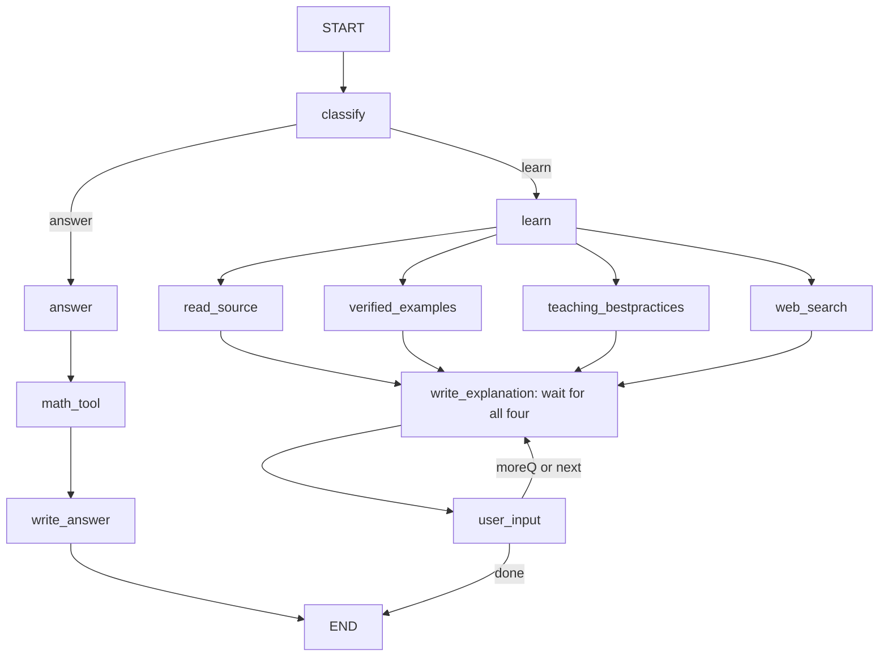

# PROJECT_MILO — Mathematics Tutor specification
Version 2.6 • 2026-10-09 • Supersedes version 2.5

## Current embedding backend — 2026-10-09

At the user's explicit direction, the active CLI generates document and query embeddings using **AvalAI `text-embedding-3-large`**, 3,072 dimensions, `cl100k_base` token counts and a 2,048-token chunk budget. Send embedding requests to `https://api.avalai.ir/v1/embeddings` using `AVALAI_API_KEY` (optional separate `TUTOR_EMBEDDING_API_KEY`). Do not load a local embedding model for this backend. Use the same model, endpoint, dimensions and preprocessing for both languages and both documents/queries; do not use E5 prefixes with this API model.

Keep source documents, JSONL, metadata and vectors local. Preserve structural units, exact mathematical content, stable IDs, provenance and content hashes; cache unchanged vectors and embed only new/changed content. Save API model identity, provider endpoint, dimensions and preprocessing in each cache manifest. Provider-managed aliases cannot claim a pinned local revision; rebuild after a known provider/model change. Bound requests and validate index order, numeric vectors and dimensions; unavailable API/key uses labelled keyword fallback and never silently loads local models. `--offline` makes no remote embedding calls.

Prepared 28 original starter-note passages and 51 complete selected Paul examples. No incomplete/unreviewed full-book extract is embedded. Both English and Persian derivative/equation ranking cases passed with the selected model; all 79 unchanged vectors were reused without a document API request. See [the actual migration record](../sources/manifests/avalai_embeddings.json). The exact eleven-node LangGraph, four-book download scope, bilingual retrieval and three-selected-examples-per-topic/level policy remain unchanged. Existing local-model instructions are historical/optional and do not govern the active configuration.

## Mandatory LangGraph orchestration
LangGraph is REQUIRED as the sole workflow orchestration engine. Implement the graph with StateGraph, typed state/reducers, conditional edges, the all-predecessor parallel join, compilation, a checkpointer and interrupt/Command resume. Do not replace it with a hand-written Python routing loop, custom state machine, sequential helper pipeline, LangChain AgentExecutor, or another orchestration framework. Python is the implementation language for node bodies, CLI, database adapters and SymPy helpers; it is not a substitute workflow engine. LangChain/provider packages may supply model clients and messages only. Internal bounded helper calls are allowed, but must not recreate graph scheduling. The CLI input loop may gather inputs and invoke/resume the compiled graph; it must not decide or execute graph routes itself.
If the user supplies a LangGraph skill, read and apply it before implementation and reconcile it with these project requirements without changing the authorized graph. Do not claim the skill has been applied before it is provided/read.
Acceptance: tests must invoke the actual compiled LangGraph, inspect its node/edge set, exercise its conditional routes and barrier, and verify checkpointed interrupt/resume. Fake clients may replace external services, never the graph engine itself. Phase 2 already uses a real partial LangGraph for the answer branch; Phase 4 assembles the complete exact graph.

## Architecture authority
The supplied handwritten graph has now been inspected. Preserve its nodes and the user's explicit clarification that the four learning resources execute concurrently. Do not add validation, revision, finalize, planning, clarification, or retrieval coordinator nodes. Quality checks and bounded repairs are internal functions of existing nodes.

Required nodes: classify, answer, math_tool, write_answer, learn, read_source, verified_examples, teaching_bestpractices, web_search, write_explanation, user_input. START and END are LangGraph sentinels. The handwritten classifier label is implemented as classify.



The four resource arrows into write_explanation represent one all-predecessor barrier. They are not four independent triggers. No resource node feeds another resource node. On follow-up, use the user_input → write_explanation loop shown in the picture; do not rerun retrieval or invent a new graph edge. write_explanation can call the same bounded retrieval helper functions internally if a follow-up genuinely needs fresh evidence. A wholly new topic starts a new graph invocation after ending the current lesson.

## Goal and files
Build a Python CLI tutor with explicit LangGraph state and routing. agent.py contains the graph, schemas, model integration, math helpers and nodes. cli.py contains terminal commands, display, input and interrupt resume. Required libraries: langgraph, langchain, a chosen provider integration, sympy and pydantic. Optional python-dotenv and one search client. Vector databases and numpy/scipy are later extensions.

Supporting layout:
- sources/topics/{algebra,derivative,integral,limits,matrix,probability}.md
- sources/examples/paul/{algebra,derivative,integral,limits,optimization}.jsonl
- sources/teaching_bestpractices.md
- requirements.txt, .env.example, README.md and focused tests.

## Routing and node contracts
| Node | Responsibility |
|---|---|
| classify | Validate mode answer or learn, topic, language and preferences. Missing essential details are resolved by an interrupt inside this node, without additional edges. |
| answer | Prepare a validated supported calculation payload. |
| math_tool | Safely run differentiation, integration, limits, solving, matrices or simplification. |
| write_answer | Return a concise result with indispensable assumptions, restrictions or + C. No unsolicited full tutorial or example. |
| learn | Establish learner level, full/step delivery, lesson objective and evidence request shared by all resource nodes. |
| read_source | Retrieve bounded topic excerpts from local OpenStax-based notes with provenance. |
| verified_examples | Retrieve relevant existing Paul examples from the local bank, choose by topic/level and verify supported claims. No default LLM-generated replacement. |
| teaching_bestpractices | Read original level-specific teaching rules. |
| web_search | Search independently using question/topic/level, or return explicit skipped/error status. Never wait on local sources. |
| write_explanation | Combine all four results, teach at the selected level, include a simple sourced example when available, and apply internal checks. |
| user_input | Checkpoint and pause for next, a follow-up, full explanation or done; resume the same lesson and thread. |

## State
Use a typed state and validated structured routing outputs. Nodes return partial updates.
| Field | Contract |
|---|---|
| mode | Literal answer or learn; explicit user choice wins |
| query, topic, language | Current request, normalized topic, fa/en |
| learner_level | Literal beginner, intermediate or advanced; unknown may be null until learn selects a provisional accessible default |
| delivery_mode | full or step |
| messages | Message reducer; bounded relevant history |
| problem, math_result | Validated payload and structured result/status/conditions |
| source, examples, teaching_tips, websearch | Separate evidence fields; one owner each |
| explanation, final_answer | Current visible chunk and concise answer output |
| lesson_plan, step_index, last_emitted_step | Stable lesson progression; never reset on next |
| user_decision | moreQ or done; next maps to moreQ with continuation action |
| user_action, followup_query | next, followup, full, done; latest teaching request |
| clarification_count, repair_count | Bounded internal repair/input attempts |
| warnings, execution_trace | Append reducers for concurrent writers |

Keep credentials out of state. Reset request fields before a new graph invocation; preserve explicit preferences and appropriate session history. Resource nodes write disjoint fields. If retaining the picture's Annotated[list, add] shape for evidence, prevent duplicate evidence on follow-ups and clear stale evidence at a new request boundary. Prefer typed per-resource results including status, records and warning.

## Actual parallel execution
Fan out from learn to all four nodes. Register the barrier with:
```python
resources = ['read_source', 'verified_examples', 'teaching_bestpractices', 'web_search']
for name in resources:
    builder.add_edge('learn', name)
builder.add_edge(resources, 'write_explanation')
```
Use asynchronous clients/ainvoke or genuine concurrent node execution; a synchronous loop calling four helpers is not acceptable. Independent branches receive the same pre-fan-out state. Every branch returns a typed success/empty/skipped/error result on recoverable failure so the join can proceed. Bound external request time. Do not also register independent branch-to-writer edges.

## Teaching interaction
Answer mode: for 2x+5=17, normally display x=6, with relevant conditions only. Requests to understand or see teaching steps use learn.
Full mode: deliver one coherent explanation appropriate to level, then reach user_input for follow-up or done.
Step mode: display one small teaching step, normally 2–3 short sentences plus necessary notation; then interrupt at user_input. Never emit the next step automatically. “بعدی”, “ادامه”, “next” and an unambiguous “اوکی” advance one step. “نفهمیدم” explains the current step more simply without advancing. A question is answered before continuing. “کامل بگو” changes to full and explains the remaining material. “تمام” ends.
Use a checkpointer and Command(resume=...) on the same thread ID. Resume must not create a new lesson or repeat the displayed step. Put display in CLI after graph events/state updates; avoid side effects before an interrupt that would repeat when the node restarts. At lesson completion user_input still allows follow-up or done; never invent endless new steps.

## Three teaching levels
Use beginner, intermediate and advanced; Persian labels are مبتدی، متوسط، پیشرفته. Estimate per topic, accept explicit settings, and simplify when the learner reports confusion. These are project categories, not a validated proficiency test.
| Level | Explanation style |
|---|---|
| beginner | Everyday intuition, define symbols, small steps and a simple example |
| intermediate | Connect intuition to definitions, explain method selection and common mistakes |
| advanced | Precise definitions, assumptions, proof sketches and relevant exceptions |

Clarity matters at every level. Higher level means greater depth and justified rigor, not unnecessarily complicated language. Create 15 original teaching rules: familiar context before abstractions when helpful; explain symbols; one main idea per chunk; connect representations; select matching examples; alternate a worked example with optional learner practice; ask focused understanding checks; adapt to misconceptions; preserve domain assumptions; avoid presenting analogy as proof; reduce routine detail as proficiency grows; give counterexamples when useful; preserve learning continuity; let the user set pace; acknowledge uncertainty. The IES guide in the sources file supports worked examples, concrete/abstract connections and explanatory questions. Three levels and 2–3 sentence chunks are project choices.

## Paul example bank
Use the existing linked lesson pages (embedded worked examples) and practice indexes (separate problems and solutions). Acquisition is a separate preparation step, not a new runtime graph node. Preserve statement, solution, mathematical notation, page URL, section title, visible example number, source author, retrieval date and usage terms. Do not fabricate example numbers or anchors. Expand collapsed solutions when extracting. Keep LaTeX/MathJax instead of flattening formulas to broken plain text.

JSONL record fields: id, topic, learner_level (beginner/intermediate/advanced), statement, solution, source_url, section_title, source_example_label, retrieved_at, usage_terms_url, operation_payload, proposed_result, verification_status, verification_method, assumptions. A retrieved source solution is source-backed, not automatically computationally verified. SymPy statuses are verified/rejected/unknown/unsupported. Verify antiderivatives by differentiation, roots with domain/completeness checks where decidable, and matrix claims with appropriate identities. Numeric sampling is not proof. Unsupported examples can be labelled source-backed with verification unavailable; never falsely call them SymPy verified. If no Paul example fits, say no suitable sourced example is available; an original generated fallback requires explicit configuration and distinct provenance.

## Mathematical reliability and safety
Validate expression trees/allowlisted operators before constructing SymPy objects. Never execute model-produced Python or unrestricted eval/exec/sympify/parse_expr input. Bound expression depth/size, matrix dimensions and execution time; use killable spawn-compatible workers on Windows. Keep domains, exclusions, integration constants, one-sided limit conditions and unevaluated results. Do not equate all SymPy outputs with solved mathematics. Internal checks in writers may repair drafts at most twice without extra graph nodes. LLM review does not prove arbitrary prose.

## CLI
python cli.py; commands /help, /mode answer|learn, /delivery full|step, /level beginner|intermediate|advanced, /language fa|en, /reset, /debug on|off, /exit. Load optional .env once. Missing keys get readable errors without revealing credentials. Handle Unicode, empty input, EOF and Ctrl+C. /reset ends pending work and uses a new thread. Commands during interrupts must not accidentally become mathematical replies. Done exits the current graph, not necessarily the CLI.

## Acceptance and done
Test the exact node set and edges; no extra routing nodes. Verify four resource tasks start before any is required to finish, and the writer runs exactly once after all finish, including skipped/failed web search. Test concise x=6 answer; beginner/advanced differences; full lesson; one step then pause; next advances once; simplify stays on current step; follow-up preserves context; done reaches END; reset clears pending work. Test retrieval of Paul provenance, rejection of an incorrect example, no invented source when bank is missing, secure bounded math, malformed structured output and recoverable API errors. Test derivative, definite/indefinite integral, one/two-sided limit, equation roots, singular matrix and simplification exclusions. Use fake clients for offline graph tests. Record actual tested versions and actual test results during implementation.

This deliverable is a specification, not implemented code or downloaded books/example text.


## Compact example-bank policy — latest user requirement
Use exactly three curated examples per atomic topic/subtopic and each of beginner, intermediate and advanced when suitable source examples exist: nine records per topic, not an entire scraped course. A fourth example is optional only when explicitly needed; default remains three. Course tags Algebra/Calculus I/II/III group records; the quota applies to individual topics such as derivative power rule, chain rule, limits or substitution, not a whole calculus course. Do not inflate the bank with duplicates or fabricate missing examples; report incomplete coverage if a source lacks a suitable level.
Store topic, subtopic, course, learner_level, example_id, source URL, statement, solution and verification metadata. Select one example from the matching topic/level pool to show at the end of the explanation, or when the learner asks. Do not display all three. Avoid repeating the last example when another suitable candidate exists. In step mode, present the example at the appropriate final teaching step after user continuation; do not append future steps early. Answer-only mode remains concise without an unsolicited example.
Local-file semantic retrieval with a persisted embedding cache is the default backend. No database service is required; PostgreSQL + pgvector is a later optional extension. Preserve topic/level/type metadata and provenance, with honest keyword fallback. Embeddings are built only after corpus preparation.
Acceptance: verify the three-valued enum/CLI setting, a maximum default bank of three examples per topic/level, one selected example per explanation, no duplicate import growth, and honest handling of missing level coverage.


## Implementation workflow — latest user requirement
Execution is phase-by-phase, controlled by the single master implementation prompt. The seven phases are: (1) environment/configuration/state contracts; (2) working concise answer path; (3) limited four-book acquisition, readable text, topic notes and curated Paul examples; (4) exact parallel full-learning graph; (5) interactive step CLI; (6) bilingual local semantic retrieval; (7) live web search and final integration. Finish the current phase and its exit checks, update IMPLEMENTATION_STATUS.md, report actual results, then wait for explicit user continuation. Do not automatically implement later phases. Intermediate unavailable nodes/features must be labelled incomplete; final architecture requirements stay unchanged. All detailed instructions and exit gates are in math_tutor_implementation_prompt.md, not separate per-phase prompt files.


## Structural chunking and bilingual local semantic retrieval
Use local Markdown/JSONL plus a persisted embedding cache as the default. No PostgreSQL/pgvector service is required for this CLI; a database is a later optional extension. Keep this implementation inside existing retrieval helpers and graph nodes.
1. Split source text by headings and coherent instructional units: definition, rule/theorem with hypotheses, or worked example. Do not make an entire large topic one chunk or blindly split at a fixed character boundary. Keep formulas, symbol definitions and domain conditions together. If a unit exceeds the embedding model token limit, split at meaningful boundaries and retain parent/adjacent chunk references so context can be reconstructed.
2. Each curated question/example and its solution is one logical record and normally one chunk. Keep the source URL, example label, topic, subtopic, course, learner_level and verification metadata with it. For an oversized solution, use linked child chunks while retaining one example ID and the complete logical record. Chunk count does not change the three-examples-per-topic-per-level quota.
3. After downloading, cleaning and checking source material, embed each chunk once with a model suitable for Persian-English cross-language retrieval. Embed queries in either fa or en with the SAME model/version and compatible settings/dimension; do not mix embedding models. The model is selected and tested during Phase 6, not assumed verified now. Record model ID/version, dimension, normalization, preprocessing version and chunk content hash in the cache manifest. Re-embed changed/new chunks; rebuild when incompatible model/settings change.
4. Store vectors locally (e.g. NumPy arrays) with stable chunk IDs and JSON metadata; retrieve via cosine similarity or the model's documented metric. Filter examples by topic/subtopic and learner level, then rank eligible records. Source prose is filtered by relevant topic and compatible depth where available. Return bounded actual text and provenance to the writer, not just vectors. Avoid an overly strict inferred-topic filter silently eliminating relevant evidence; report empty/uncertain coverage or use a controlled broader source search.
5. Run small fixed retrieval checks with Persian and English questions, including Persian queries against English sources, paraphrases and distractor passages. Confirm mathematical content, assumptions and source provenance, not merely a high similarity score. A missing model/cache must degrade to honest metadata/keyword retrieval; never claim semantic retrieval ran when it did not.
6. Embeddings rank relevance and do NOT certify correctness. Validate supported calculations with SymPy and check assumptions/source consistency inside existing nodes. Unknown verification remains unknown; request essential missing information and avoid asserting an unsupported answer as certain.


## Phase 3 — Limited source downloading and preparation
Limited downloading belongs to Phase 3, not a prerequisite acquisition phase. Download exactly one official PDF for each of the four books below. At execution time resolve the current PDF download URL from that book's official page; do not guess a URL or treat an old direct link as current. Do not download additional textbooks, alternate formats/editions, entire websites or the entire Paul example collection.

| Book | Official source page | PDF path | Extracted text path |
|---|---|---|---|
| Calculus Volume 1 | https://openstax.org/details/books/calculus-volume-1 | sources/raw/openstax/calculus-volume-1.pdf | sources/text/openstax/calculus-volume-1.md |
| Calculus Volume 2 | https://openstax.org/details/books/calculus-volume-2 | sources/raw/openstax/calculus-volume-2.pdf | sources/text/openstax/calculus-volume-2.md |
| College Algebra 2e | https://openstax.org/details/books/college-algebra-2e | sources/raw/openstax/college-algebra-2e.pdf | sources/text/openstax/college-algebra-2e.md |
| Introductory Statistics 2e | https://openstax.org/details/books/introductory-statistics-2e | sources/raw/openstax/introductory-statistics-2e.pdf | sources/text/openstax/introductory-statistics-2e.md |

Save PDFs in sources/raw/openstax/ and extract readable text to sources/text/openstax/. Retain headings, page boundaries, formulas, symbol definitions and assumptions where possible. Record missing glyphs, flattened fractions/powers, lost bounds, image-only/sparse pages and other extraction problems per book. PDF text extraction is not proof of formula fidelity: review representative mathematical content against the original before using it in topic notes or embeddings. Failed downloads/extractions remain failed/incomplete; do not manufacture source text or claim success.

During authorized Phase 3 execution create sources/manifests/openstax_core.json with exactly four book records. Each record includes title, source_url, pdf_url (resolved from the official page), license and license_url as actually observed, raw_path, text_path, download_status, actual_file_size_bytes, extraction_status and extraction_problems. Also retain retrieved_at, edition and hashes where available. Use null for unavailable URLs/licenses/sizes; distinguish not_attempted, failed, incomplete and downloaded. Measure completed PDF sizes from actual local files, report partial-transfer bytes separately, and sum only completed downloads for total_actual_download_bytes; report extracted-text bytes separately. Unknown Content-Length is not a zero-byte file or a measured size.

Paul policy is unchanged: three selected examples per atomic topic/subtopic and each beginner, intermediate and advanced level where suitable examples exist. Use the existing linked lesson/practice pages selectively; do not crawl/download the entire collection. Keep every selected original problem together with its solution, mathematical notation, visible source example label, attribution, URL, retrieval date and terms. Verify supported calculations with SymPy; preserve verified/rejected/unknown/unsupported status and report missing level coverage without fabricated examples. Display one matching example per explanation according to the existing policy.

Downloading is scheduled for Phase 3 only. If another phase or documentation-only work is currently authorized, update the documents and stop without downloading or extracting. Existing originals remain preserved; additional books are not added to the required scope.

## Phase 3 execution status — 2026-10-09

Phase 3 was explicitly authorized and executed on 2026-10-09. Exactly four official PDFs were resolved and downloaded: **207,178,833 actual bytes**, zero partial transfers; readable extracts total **5,397,578 bytes**. Actual PDF/license URLs, author metadata, paths, hashes, page diagnostics and statuses are in [the core manifest](../sources/manifests/openstax_core.json).

The Phase 3 exit is **incomplete**: visually reviewed pages show missing formula images or flattened notation in all four extracts, which remain excluded from retrieval. Seven clearly attributed original starter notes, 15 original level-specific teaching rules, a schema/deduplicating importer and 51 distinct selected Paul examples are prepared. Mathematical result checks: 27 verified, 23 unsupported, one unknown; 21 topic/level slots remain missing. The three-per-topic-per-level policy is unchanged. No additional books, full-site crawling or entire example collection was downloaded; LangGraph-only execution and bilingual retrieval remain unchanged. No later phase was implemented in this run.

See [the Phase 3 report](../sources/manifests/phase3_report.md), [selected-example counts/rationales](../sources/manifests/paul_selection.json) and [topic registry](../sources/manifests/topic_registry.json) for actual results and remaining work. Earlier acquisition reports are historical.
